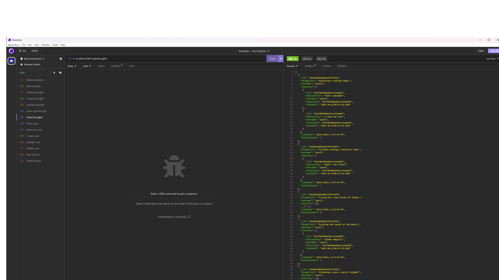

# Social network
  
  ## Description
  This project allows create and update users, thoughts, reactions and friends. All of it has relations
  ## Table of Contents
- [Installation](#installation)
- [Usage](#usage)
- [Iicense](#Iicense)
- [How to contribute](#how-to-contribute)
- [Tests](#tests)
- [Questions](#questions)
## Installation
npm install
## Usage
npm start and do nessesary requests

  
## Iicense
None
## How to contribute
N/A
## Tests
N/A
## Questions
* Github: https://github.com/Unk171
* You can send your questions to my e-mail: 7353687@gmail.com
* video: https://drive.google.com/file/d/1_byLOQ7bAmjGvff0fUixvYS9jdjQEao-/view
  
